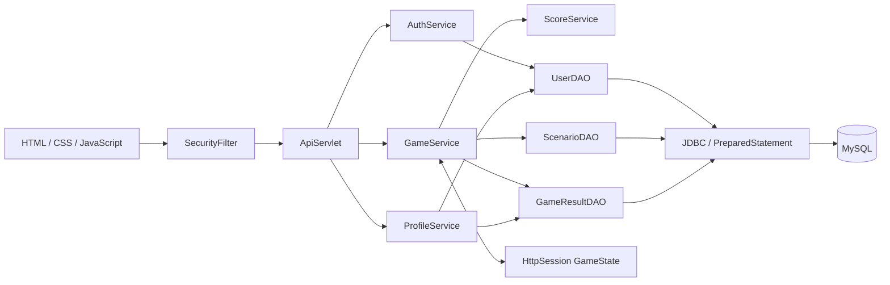
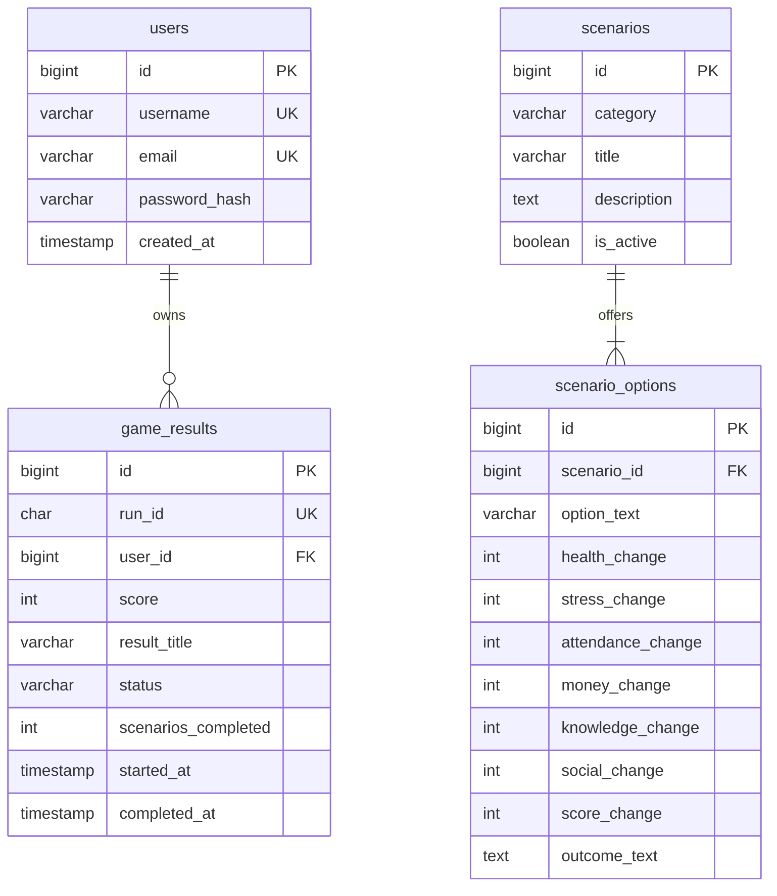

# Architecture and database

The application is one Maven WAR. Tomcat serves static HTML/CSS/JavaScript and a Jakarta Servlet API. All business decisions happen in Java. MySQL stores accounts, scenario definitions, choices and finished attempts.

The API servlet combines the small project's route dispatch in one controller. Services validate accounts, produce game transitions, calculate results and assemble profiles. DAOs own SQL; model classes contain state and public-response projections. Utilities load environment configuration, open connections, validate input and hash passwords.

A run selects ten different active scenarios. `GameState` stores a snapshot of those scenarios in the authenticated session. Every choice creates a copy of the previous state. At completion, the DAO saves the result before the controller replaces session state. A database exception leaves the prior state available to retry. `run_id` is unique in MySQL, so a retry after an uncertain database outcome cannot insert another row. Requests lock the session while reading or changing gameplay.

`game_results` also stores each final stat. An index supports descending score scans; a composite user/date index supports paginated history. The leaderboard selects one best non-quit result per player using MySQL 8's `ROW_NUMBER`. Tied scores use the earliest completion and username for deterministic ordering; the profile's rank is the competition rank (1 plus the number of higher personal-best scores).

Report material: the problem is converting familiar student dilemmas into a repeatable decision game. Objectives are session authentication, server-controlled simulation, durable results and responsive presentation. Modules are authentication, game engine, scenario content, score/result storage, history, leaderboard and profile. Tests and screenshots in the accompanying documents provide evidence for the practical report. Remaining scope is listed in the implementation README.
